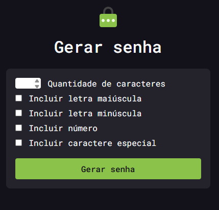

<div align="center">

# 🔑 Gerador de Senhas

Uma ferramenta simples e customizável para gerar senhas seguras, com opções de tamanho e tipos de caracteres, construída com HTML, CSS e JavaScript puros.


[🔗 Ver Demo](https://gerador-de-senhas-eight-beta.vercel.app)

</div>

---

## 📌 Sobre o Projeto

Este projeto é um gerador de senhas aleatórias com foco em **usabilidade e customização**, criado para praticar fundamentos de front-end: manipulação do DOM, geração aleatória de caracteres via JavaScript e integração com bibliotecas externas. O usuário escolhe o tamanho da senha e quais tipos de caractere incluir (maiúsculas, minúsculas, números e símbolos), gera a senha e copia com um clique.

## 🖼️ Demonstração

<div align="center">



</div>

> 💡 Acesse a [demo ao vivo](https://gerador-de-senhas-eight-beta.vercel.app) para testar você mesmo.

## ✨ Funcionalidades

- 🔢 Escolha da quantidade de caracteres da senha
- 🔠 Opção de incluir letras maiúsculas
- 🔡 Opção de incluir letras minúsculas
- 🔟 Opção de incluir números
- ✳️ Opção de incluir caracteres especiais
- 📋 Botão de copiar senha com um clique
- 🔔 Notificação visual (toast) ao copiar

## 🛠️ Tecnologias

| Tecnologia | Uso |
|---|---|
|  | Estrutura da página |
|  | Estilização e responsividade |
|  | Lógica de geração aleatória da senha |
|  | Ícone do botão de copiar |
|  | Notificação de "senha copiada" |

## 🚀 Como Executar

```bash
# Clone o repositório
git clone https://github.com/Geandysson/Gerador-de-Senhas.git

# Acesse a pasta do projeto
cd Gerador-de-Senhas

# Abra o index.html no navegador
# (ou use a extensão Live Server no VS Code)
```

Não há dependências para instalar é um projeto 100% front-end estático (Font Awesome e Toastify.js são carregados via CDN).

## 📂 Estrutura do Projeto

```
Gerador-de-Senhas/
├── src/
│   ├── styles/
│   │   └── style.css        # Estilos da interface
│   ├── img/
│   │   ├── icone.png          # Favicon
│   │   └── illustration.svg  # Ilustração principal
│   └── javascript/
│       └── script.js          # Lógica de geração de senha
├── index.html                  # Estrutura principal da página
```

## 🎯 Aprendizados

- Geração de strings aleatórias em JavaScript a partir de conjuntos de caracteres
- Manipulação de formulários e checkboxes para regras condicionais
- Integração de bibliotecas externas (Toastify.js) via CDN
- Uso da API `navigator.clipboard` para copiar texto
- Organização de projeto front-end simples e escalável

## 👤 Autor

**Geandysson**

[](https://github.com/Geandysson)

---